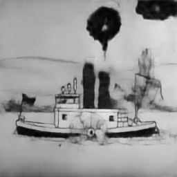
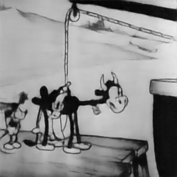
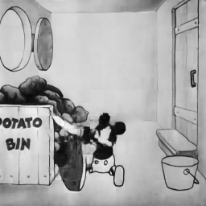
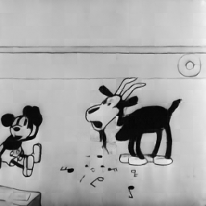

# Video Generation Model
Heavy inspiration from the following work:

[VideoGPT](https://github.com/wilson1yan/VideoGPT)

[FSQ-VAE](https://arxiv.org/abs/2309.15505)

[ViViT](https://arxiv.org/pdf/2103.15691.pdf)

[Sora Tech Report](https://openai.com/research/video-generation-models-as-world-simulators)

[Sora Reverse Engineering](https://arxiv.org/abs/2402.17177)

## Goal

**Use FSQ-VAE encoder to build a sequence of latent vectors representing spatio-temporal patches
("spacetime patches" in Sora tech report / "tublets" in ViViT paper) from the video frames in the input context.**

**These sequences of latent vectors are then modeled by a Transformer Decoder, and subsequently mapped back
to spatio-temporal patches using FSQ-VAE decoder.**

## Dataset Source
Steamboat Willie source: https://archive.org/download/steamboat-willie-mickey

## Current Highlights
Clip reconstructions from roadmap steps 3 and 4

*best 16-frame, full spatial dimension reconstructions from VQ-VAE before switching to FSQ*:

*best 16-frame, full spatial dimension reconstructions reconstructions from FSQ-VAE*:

*current best tubelet reconstructions from FSQ-VAE (rearranged back into clip)*:

## Project Roadmap

- [X] Part 1: VAE (for knowledge/context) - CIFAR10

- [X] Part 2: VQ-VAE/VQ-VAE 2 (Conv2D) - CIFAR10

- [X] Part 3: VQ-VAE (Conv3D) - Steamboat Willie

- [X] Part 3.5: FSQ-VAE (Conv3D) - Steamboat Willie

- [X] Part 4: Tubelet FSQ-VAE (Conv3d) - Steamboat Willie

- [X] Part 4.5: Build auxiliary dataset of pre-encoded clips using FSQ-VAE encoder + quantizer

- [ ] Part 5: Transformer Decoder - model sequences of tublet latent vectors from Part 4

- [ ] Part 5: Video Generation - put it all together

## Tubelet FSQ-VAE/VQ-VAE (Spatio-Temporal Patch Compression)
Originally, my idea was to compress 16-frame, full spatial dim video clips with a VAE as proposed in VideoGPT
to produce latent sequences for a transformer decoder to model. However, this approach is problematic due to the
number of latent vectors that would be produced for a single clip (I want to model longer videos). Instead, I am taking
inspiration from the "spacetime patches" approach from the Sora tech report, which is similar to "tubelets"
in ViViT. The goal is to utilize an FSQ-VAE to produce a sequence of d-dimensional latent vectors as shown in the
tubelet figure above, which can be both modeled by a transformer decoder and mapped back to pixel space by the FSQ-VAE decoder.

Additionally, I decided to use Finite Scalar Quantization for the discretization step in the VAE used to produce latent visual
features, as I ran into a lot of the problems it mentioned with Vector Quantization, and I wasn't interested in all the hacky
or complicated workarounds proposed to mitigate its issues like random restarts, entropy regularization, etc.

## Transformer Decoder (Spatio-Temporal Latent Prediction)
The resulting spatio-temporal latent vactors are used as tokens for a transformer decoder to learn to model sequences of
video frames in spatio-temporal latent space.

For this, I will use FlashAttention2 in conjunction with the ALiBi positional encoder to efficiently model sequences while
being able to extrapolate to longer sequences at inference time. 

## Putting Everything Together
Once we can map spatio-temporal patches to latent space and model sequences of these latent vectors with a transformer
decoder, we can utilize the transformer generate new latent vector sequences and map these generated latents back into
spatio-temporal patches with the FSQ-VAE decoder.
